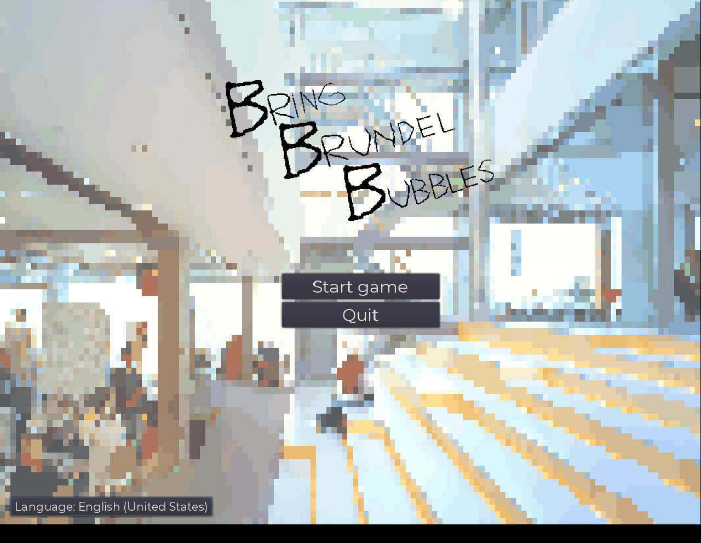
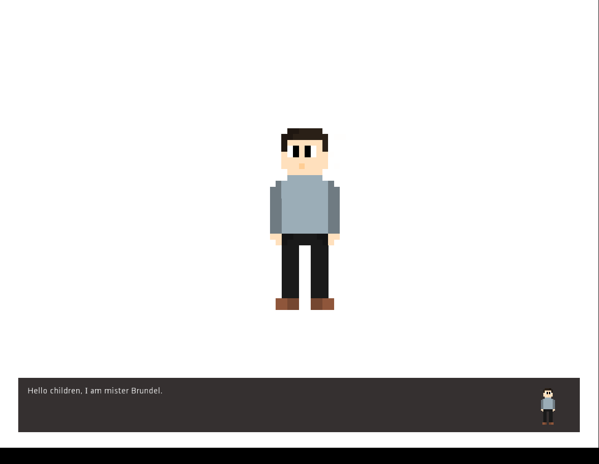
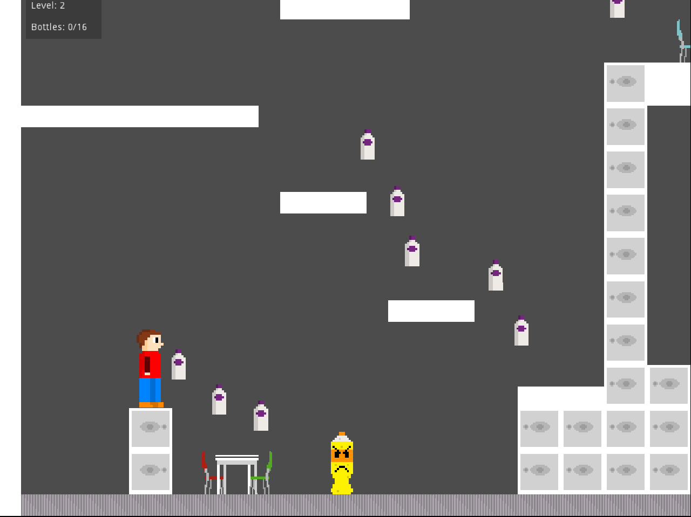

# BBB: Bring Brundel Bubbles
A game inspired by my professor Brundel. Played using the arrow or wasd keys and using internationalization. The offline game can be found at the [releases page](https://github.com/nobobo1234/bringbrundelbubbles/releases/latest) or for the online version go to [my site](https://noahvb.nl/bbb). WARNING: This game may make you want to smash your head into your keyboard. The pixel art took me ages to do but in the end I'm really proud of it :).

## Screenshots

